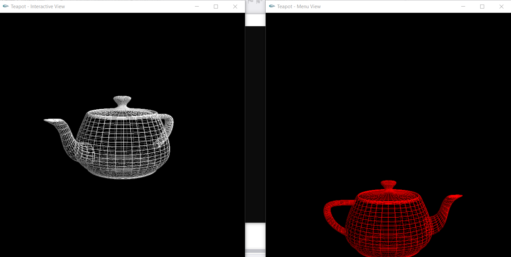
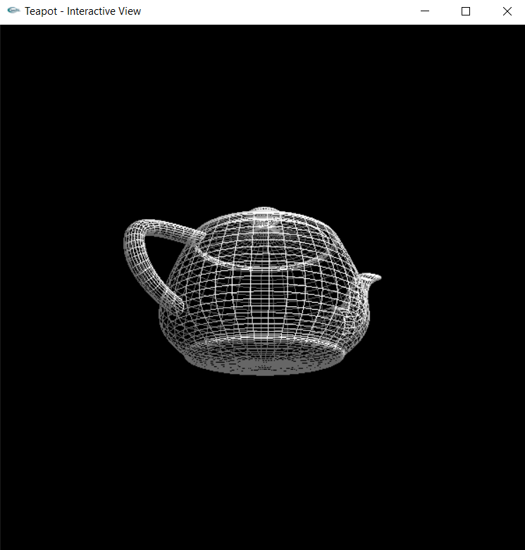
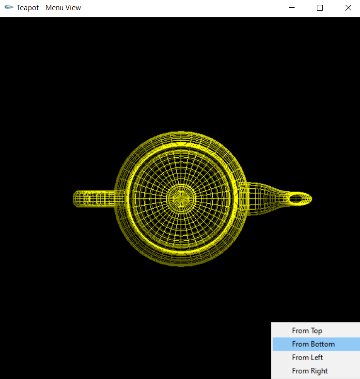
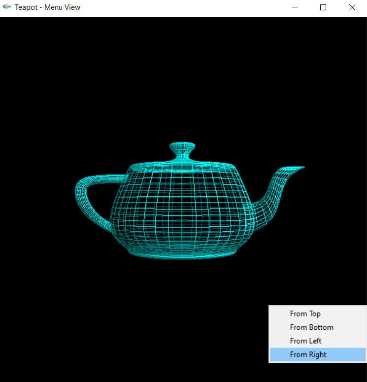

# OpenGL Teapot Project

This project was developed as part of the Computer Graphics course.
It demonstrates basic OpenGL concepts such as geometric transformations,
camera setup, mouse interaction, multiple windows, and lighting.

## Project Description

- Two separate windows are created using GLUT.
- The first window allows interactive rotation of the teapot using mouse input.
- The second window provides predefined views (Top, Bottom, Left, Right)
  selectable via a right-click menu.
- Different colors are used to distinguish between the views.
- Basic lighting is implemented as a bonus feature.

## Screenshots (Window 1 and 2)

### Interactive View (Window 1)

### Interactive View(Window 2)
   

## Technologies Used

- C++
- OpenGL
- GLUT (FreeGLUT)
- Visual Studio

## References

- OpenGL Programming Guide
- GLUT Documentation
- Course materials and skeleton code provided by the instructor

## Notes on Academic Integrity

Some parts of the initial project structure were inspired by the skeleton
code provided by the course instructor. All additional implementations,
logic, and extensions were developed independently.

